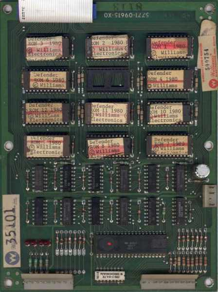
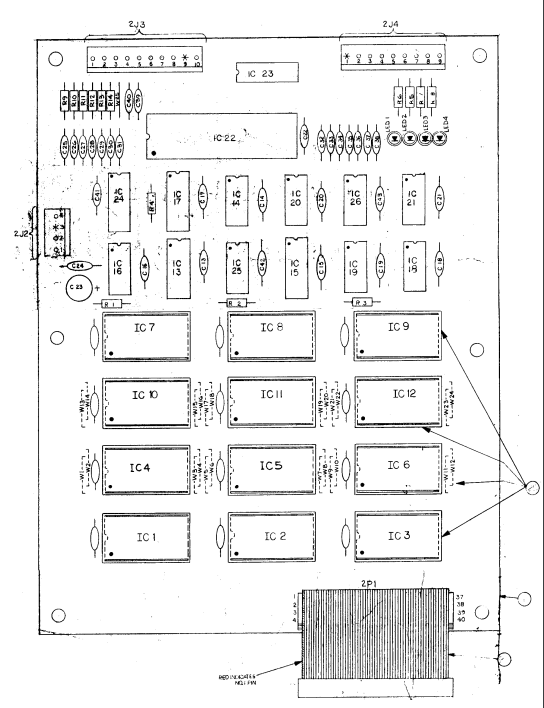
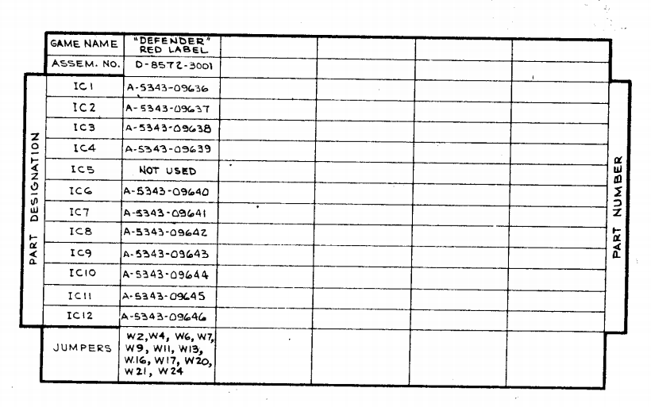

# Defender (1981) by Eugene Jarvis and Sam Dicker


This is the source code for the Williams arcade game Defender.

The source code can be assembled into the 11 rom files that would have been
loaded onto the arcade cabinet's ROM board. Today, these rom files can be used
to play the game in an emulator such as
[MAME](https://www.mamedev.org/release.html).


<!-- vim-markdown-toc GFM -->

* [Build Instructions](#build-instructions)
  * [Build Requirements](#build-requirements)
  * [Build the assembler toolchain](#build-the-assembler-toolchain)
  * [Build Defender](#build-defender)
* [Play Defender](#play-defender)
* [Notes on the Source Code, ROM Files, and the Physical Circuit Boards](#notes-on-the-source-code-rom-files-and-the-physical-circuit-boards)
  * [About the source code](#about-the-source-code)
  * [ROM Part Table with Corresponding Assembled Object Files](#rom-part-table-with-corresponding-assembled-object-files)
  * [Changes required for the source to assemble](#changes-required-for-the-source-to-assemble)

<!-- vim-markdown-toc -->
## Build Instructions

### Build Requirements
```sh
sudo apt install build-essential wine python3 flex
```

### Build the assembler toolchain

We use [`asm6809`](https://www.6809.org.uk/asm6809/) to assembler the source code for the main game and [`vasm`](http://www.compilers.de/vasm.html) to compile
the sound module. 

First you must run the following to set up the git submodules containing the assembler toolchain:

```sh
git submodule init
git submodule update
```

Now you can build the toolchain, as follows:

```sh
cd asm6809
./autogen.sh
./configure
make 
cd ..
cd vasm-mirror
make CPU=6800 SYNTAX=oldstyle
cd ..
```

### Build Defender

To build the Red Label rom files (see below for more information on what these are), do:
```sh
make redlabel
```
These will get written to a directory called `redlabel`.

## Play Defender

Once you've built defender you can now use the rom files in the `redlabel` directory to play defender on [MAME](https://www.mamedev.org/release.html). If you're on Ubuntu you can also install MAME with apt:
```sh
sudo apt install mame
```

## Notes on the Source Code, ROM Files, and the Physical Circuit Boards

### About the source code
The game source code for Defender in [src](src) was originally retrieved from
https://github.com/historicalsource/defender. It is the Motorola 6809 assembly language
source code for the 'Red Label' version of the game.

The source code for the [sound module](src/vsndrm1.src) was retrieved from https://github.com/historicalsource/williams-soundroms.

There were four versions of the game released:
White Label, Blue Label, Green Label, and Red Label, in that order. Each
release was a circuit board with the assembled code split across a number of
different ROM chips, also referred to as 'ICs'. This image of the Red Label ROM
board from [Scott Tunstall's
site](https://www.robotron-2084.co.uk/techwilliamshardwareid.html) gives you an
idea of what such a board looks like:

 

If you compare this image to [the file listing for the Red Label
roms](orig/defender-redlabel) you'll notice that the missing chip on the board
corresponds to a missing file `defend.5`:
```sh
[robert@mwenge-desktop defender-redlabel (master)]$ ls -al
total 64
drwxrwxr-x 2 robert robert 4096 Jul 11 10:32 .
drwxrwxr-x 8 robert robert 4096 Jul 11 11:02 ..
-rw-rw-r-- 1 robert robert 2048 Dec 24  1996 defend.1
-rw-rw-r-- 1 robert robert 2048 Dec 24  1996 defend.10
-rw-rw-r-- 1 robert robert 2048 Dec 24  1996 defend.11
-rw-rw-r-- 1 robert robert 2048 Dec 24  1996 defend.12
-rw-rw-r-- 1 robert robert 4096 Dec 24  1996 defend.2
-rw-rw-r-- 1 robert robert 4096 Dec 24  1996 defend.3
-rw-rw-r-- 1 robert robert 2048 Dec 24  1996 defend.4
-rw-rw-r-- 1 robert robert 2048 Dec 24  1996 defend.6
-rw-rw-r-- 1 robert robert 2048 Dec 24  1996 defend.7
-rw-rw-r-- 1 robert robert 2048 Dec 24  1996 defend.8
-rw-rw-r-- 1 robert robert 2048 Dec 24  1996 defend.9
```

So each file `defend.[x]` corresponds to a matching chip on the board and
because there is a missing chip in slot 5 we have no `defend.5` in the rom dump
listing.

In the [Defender product documentation](https://www.robotron-2084.co.uk/manuals/defender/defender_later_pcb_drawing_set.pdf) a 
chart lists the part numbers for each chip and confirms that IC5 (i.e. `defend.5`) is unused:



When we assemble the Defender source with `make redlabel` we create a bunch of
object files and then split them across the 11 files to match the 11 in the Red
Label ROM dump listing above.

Eugene Jarvis left a slightly cryptic note to how we assemble the source in [`info.src`](src/info.src):

```
 TO ASSEMBLE THE DEFENDER MESS

RASM PHR2,DEFA2,DEFB2,AMODE0;-X (ELSE CREF SYMBOL OVERFLOW)
RASM PHR2,SAMEXPA7
RASM PHR2,DEFA2,DEFB2
TO GET THE DIAGS, CHAIN ALL.CF
LOAD IT ALL AND THEN PRAY IT WORKS
(NOTE: BEWARE OF ORDER OF LOADING
       LOOK OUT FOR THE SELECTED BLOCK SHIT

DR J. 1/21/81

```

Since the `RASM` assembler is no longer available to us we use [`asm6809`](asm6809) instead. Fortunately this
does a good job of assembling the source faithfully and [only very minor modifications to the source files are
required to produce binaries](#changes-required-for-the-source-to-assemble). We recreate the steps in Eugene's notes as follows:

```
	# Build amode1 # The equivalent of: RASM PHR2,DEFA2,DEFB2,AMODE0;-X (ELSE CREF SYMBOL OVERFLOW)
	./asm6809/src/asm6809 -B src/phr6.src src/defa7.src src/defb6.src src/amode1.src\
	 		-l bin/defa7-defb6-amode1.lst  -o bin/defa7-defb6-amode1.o
```
This is the main game code with the attract mode module assembled in. `phr6.src` is a file containing definitions,
while `defa7.src` and `defb6/src` contain the main game code; `amode1.src` contains the attract mode code.

We also have to build a version of this game code without the attract mode module:

```

	# Build defa7 and defb6
	# The equivalent of: RASM PHR2,DEFA2,DEFB2
	./asm6809/src/asm6809 -B src/phr6.src src/defa7.src src/defb6.src\
 			-l bin/defa7-defb6.lst -o bin/defa7-defb6.o
```

The final module the notes mention is `samexpa7` a bunch of explosion routines added by Sam Dicker:

```
	# Build samexamp
	# The equivalent of: RASM PHR2,SAMEXPA7
	./asm6809/src/asm6809 -B src/phr6.src src/samexap7.src\
	    -l bin/samexap7.lst -o bin/samexap7.o
```

Eugene's notes are much less clear on how we go about assembling the reamining source files:

```
mess0.src
blk71.src
romf8.src
romc0.src
romc8.src
```

However the way he lists them in the notes turns out to provide a clue to the order in which they
shoud be assembled:

```
PHR6.SRC	  636 LINES
DEFA7.SRC	3,375 LINES
DEFB6.SRC	2,252 LINES
AMODE1.SRC	1,310 LINES
BLK71.SRC	  723 LINES
SAMEXAP7.SRC	  382 LINES
MESS0.SRC	  955 LINES
ROMF8.SRC	  692 LINES
ROMC0.SRC	  925 LINES
ROMC8.SRC	  839 LINES
```

We assemble the last four together in the order that they appear above:

```
	# Build roms
	./asm6809/src/asm6809 -B src/mess0.src src/romf8.src src/romc0.src src/romc8.src\
	 		-l bin/roms.lst -o bin/roms.o
```

And we assemble `blk71.src` by itself:

```
	# Build blk71
	./asm6809/src/asm6809 -B src/blk71.src -l bin/blk71.lst -o bin/blk71.o
```

### ROM Part Table with Corresponding Assembled Object Files
This table shows how the contents of each ROM chip relates back to the assembled code.

ROM Chip| Part Number|File Name|Build Binary|Start Position in Build Binary|End Position in Build Binary
| --- | --- | --- | --- | --- | --- |
IC1|A5343-09636 |defend.1|bin/defa7-defb6-amode1.o|0xb000|0xb800
IC2|A5343-09637 |defend.2|bin/defa7-defb6-amode1.o|0xc000|0xd000
IC3|A5343-09638 |defend.3|bin/defa7-defb6-amode1.o|0xd000|0xdc60
IC3|A5343-09638 |defend.3|bin/samexpa7.o|0x0000|0x02f8
IC3|A5343-09638 |defend.3|bin/defa7-defb6-amode1.o|0xdf59|0x0230
IC4|A5343-09639 |defend.4|bin/defa7-defb6-amode1.o|0xb800|0x0800
IC5|Not Used||||
IC6|A5343-09640 |defend.6|bin/blk71.o|0x0000|0x0772
IC6|A5343-09640 |defend.6|bin/roms.o|0xa778|0x0088
IC7|A5343-09641 |defend.7|bin/roms.o|0xa000|0x0800
IC8|A5343-09642 |defend.8|bin/roms.o|0x0000|0x0800
IC9|A5343-09642 |defend.9|bin/defa7-defb6-amode1.o|0x0000|0x0800
IC10|A5343-09643 |defend.10|bin/roms.o|0xa800|0x0800
IC11|A5343-09644 |defend.11|bin/roms.o|0x0800|0x0800
IC11|A5343-09644 |defend.11|Unknown||0x0800
IC12|A5343-09645 |defend.12|bin/defa7-defb6-amode1.o|0x0800|0x0800
IC12|A5343-09645 |defend.12|bin/defa7-defb6-amode1.o|0xaee9|0x0117

Replicating this arrangement of the binaries is achieved by [`ChainFilesToRom.py`](ChainFilesToRom.py) in the 
project's [Makefile](Makefile). It's a simple python script that extracts the relevant segments from each of the
binaries built in the `bin` folder when you run `make redlabel`.

### Changes required for the source to assemble
There were a few modifications to the source required along the way to get this to work.

1. Replacing macro arguments to make them compatible `asm6809`,e.g.:
```diff
-NAPP    MACRO  \0,\1
-        LDA    #\0
-        LDX    #\1
+NAPP    MACRO  \1,\2
+        LDA    #\1
+        LDX    #\2
         JMP    SLEEPP
         ENDM 
```

2. Replacing the use of `$` in label names, e.g.:
```diff
-INIT$V  EQU    HOFV+2
-HALLDV  EQU    INIT$V+2
+INITSSV  EQU    HOFV+2
+HALLDV  EQU    INITSSV+2
```
3. Replacing the use of '.' in label names, e.g.:
```diff
-        LDY    #.P1SCR          ;START WITH PLAYER 1
+        LDY    #P1SCR           ;START WITH PLAYER 1
```

4.  Work around the fact that `RASM` seems to have allowed you to assemble code sections into overlapping
memory segments. For example both `amode1.src` and `defa7.src` want to assemble into position `$C000` in
the ROM, meaning that one will overwrite the other. This explains why the main game files get assembled
twice, once with attract mode (`amode1.src`) and once without: they wanted a binary with some segments
overwritten with attract mode features and one without. We achieve this ourselves by modifying the source
to assemble and place the attract mode code to position `$2000` in memory, and when we later split the
object files into the `defend.x` files pick the chunk of code we're interested in:
```diff
@@ -111,6 +111,8 @@ YSHIP   EQU    $5000
 AMTYPE  EQU    0
 
         ORG    $C000
+        PUT    $2000
+
         JMP    HALLOF           ;VECTORS
         JMP    SCNR
```
5. In `amode1.src` I had to replace a few hard-coded constant values to match what was in the binary:
```diff
diff --git a/src/amode1.src b/src/amode1.src
index 543cb7e..cdaeb1e 100755
--- a/src/amode1.src
+++ b/src/amode1.src
@@ -145,19 +147,19 @@ HALL1   STA    PNUMB            ;PLAYER NUMBER
 HALL1A  JSR    P2SW
 HALL1B  LDB    #$85             ;LIGHT BLUE LETTERS
         STB    PCRAM+1
-        LDA    #$FE             ;TODAYS SOUND - PHANTOM
+        LDA    #$3E             ;TODAYS SOUND - PHANTOM
         LDX    #THSTAB          ;TODAYS TOP SCORE
         JSR    CPXCY            ;COMPARE
         BHS    HALL2            ;NOT THE BEST?
-        LDA    #$FD             ;HIGH SCORE SOUND - TOCCATA
+        LDA    #$3D             ;HIGH SCORE SOUND - TOCCATA
 HALL2   LDX    #$CC02           ;SOUND PIAS
-        LDB    #$FF             ;CLEAR LINES
+        LDB    #$3F             ;CLEAR LINES
         JSR    STBXBV
-        LDB    #$E4             ;SELECT ORGAN
+        LDB    #$24             ;SELECT ORGAN
         JSR    STBXBV
-HALL3   DECB     DELAY
+HALL3   DECB                    ;DELAY
         BNE    HALL3
-        LDB    #$FF             ;CLEAR LINES
+        LDB    #$3F             ;CLEAR LINES
         JSR    STBXBV
         TFR    A,B
         JSR    STBXBV           ;PLAY SOUND
``` 

7. Update the bit-shift and bit-wise comparison notation to be compatible with syntax expected by `asm6809`, e.g.:
```diff
-        LDX    #WCURS!.$C35A    ;CONFUSION
-        LDD    #WCURS!.$3CA5    ;MORE CONFUSION
+        LDX    #WCURS&$C35A    ;CONFUSION
+        LDD    #WCURS&$3CA5    ;MORE CONFUSION
@@ -1206,7 +1208,7 @@ MT1     LDD    BGL              ;CALC SCANL
         LDA    STATUS
         BITA   #2               ;NO TERRAIN???
         BNE    MTX              ;NONE
-        LDA    #SCANER!>8
+        LDA    #SCANER>>8
         LDY    #STETAB          ;ERASE TABLE
```
8. Comment out some directives not used by `asm6809`, e.g.:
```diff
index d2d7212..86d4bf0 100755
--- a/src/blk71.src
+++ b/src/blk71.src
@@ -1,6 +1,6 @@
-        TTL    D E F E N D E R   1.0
-        NMLIST
-        NOGEN
+*       TTL  D E F E N D E R   1.0
+*       NMLIST
+*       NOGEN
```


10. This one may be worth investingating further. The code references `P1LAS` when it needs to be `P1LAT` to match
the Red Label binaries. Would be interesting to know if this sheds any light on the version of the source code as it
looks very like a typo that was bug-fixed.
```diff
@@ -831,14 +831,14 @@ CSCX    RTS
 *DISPLAY LASERS
 *
 LDISP   PSHS   D,X,Y,U          ;PLAYER 1
-        LDX    #P1LAS
-        LDA    .P1LAS
+        LDX    #P1LAT           ;Fixme was: #P1LAS
+        LDA    P1LAS
         BSR    LDSP
         LDA    PLRCNT
         DECA 
         BEQ    LDPX
-        LDX    #P2LAS
-        LDA    .P2LAS
+        LDX    #P2LAT
+        LDA    P2LAS
         BSR    LDSP
```

11. I needed to modify the `KILP` and `KILO` macros to assembly properly with `asm6809`. Removing the addition of `$`
to the argument in the macro itself and instead adding it before passing the argument:
```diff
-KILP    MACRO  \0,\1
+KILP    MACRO  \1,\2
         JSR    KILPOS
-        FDB    $\0
         FDB    \1
+        FDB    \2
         ENDM 
-KILO    MACRO  \0,\1
+KILO    MACRO  \1,\2
         JSR    KILOS
-        FDB    $\0
         FDB    \1
+        FDB    \2
         ENDM 
index 33665f5..3f4c5ac 100755
--- a/src/defb6.src
+++ b/src/defb6.src
@@ -73,13 +73,13 @@ UFONV4  ADDA   #10
         CLRB 
         LDA    XTEMP+1
         ADDD   PLAYV
-        ASRA     DIVIDE           ;BY 2
+        ASRA                    ; DIVIDE BY 2
         RORB 
         STD    OYV,X
 UFONVX  RTS  
 *UFOKILL
 UFOKIL  DEC    UFOCNT
-        KILP   0120,UFHSND
+        KILP   $0120,UFHSND
         RTS  
 *
```

12. Replace some single-quotes with double-quotes for compatibility with `asm6809`, e.g.:
```diff
@@ -780,21 +780,21 @@ A28     FCC    "SPECIAL         ;FUNCTION/"
 * DEFAULT HERE FOR NOW
 *
 DEFALT  FCB    $02,$12,$70      ;CRHSTD
-        FCC    'DRJ'
+        FCC    "DRJ"
         FCB    $01,$83,$15      ;CRHST1
-        FCC    'SAM'
+        FCC    "SAM"
         FCB    $01,$59,$20      ;THSTD2
-        FCC    'LED'
+        FCC    "LED"
```

13. `blk71.src` has to be assembled with 6309 extensions and `STX [,Y]` has to be changed to the `COMF' instruction
in order to get it to match with the ROM binaries.

```asm
./src/blk71.src:191: TTER03  COMF       ;Was: STX    [,Y]             ;FAST OUTPUT
```

14. In a few cases I've had to replace the values of constants in the code to match the ROM binaries. These are:
```asm
./src/romc0.src:78:        FDB    $D9FF               ;Fixme was: $FFFF
./src/defb6.src:2170:      FDB    $0000,$00FE,$C300 ; Fixme: $C300 was $6600
./src/mess0.src:68:        FDB    $5BFF              ;Fixme was: $FFFF
./src/mess0.src:654:       FDB    $84FF              ;Fixme was: $FFFF
```


